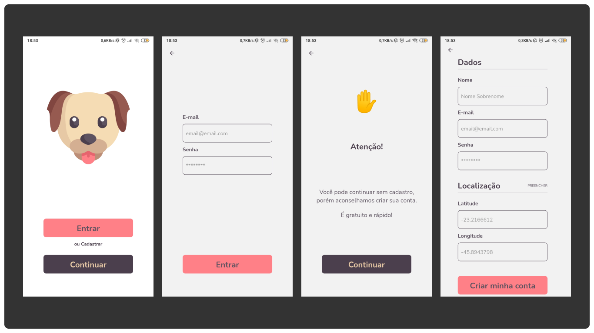
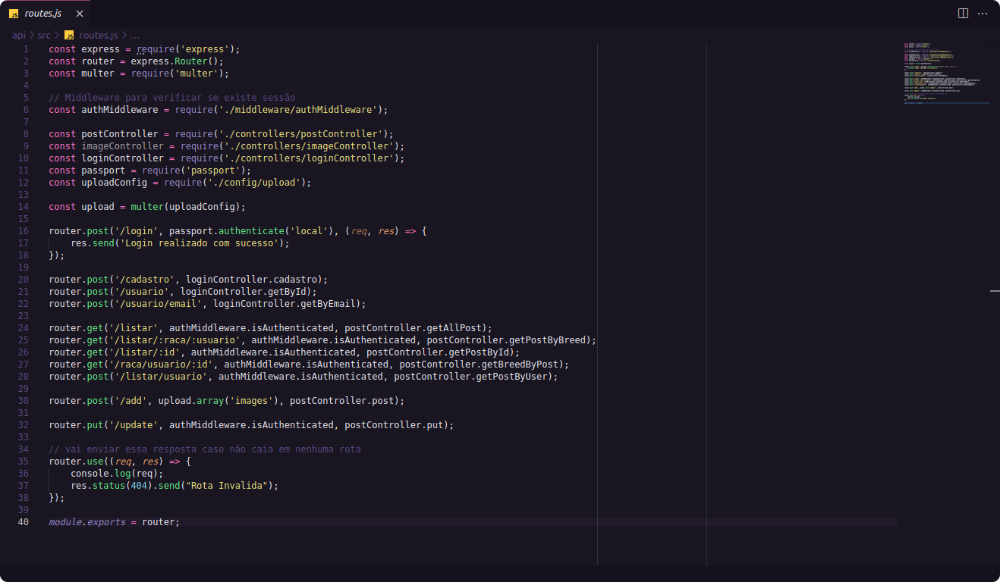
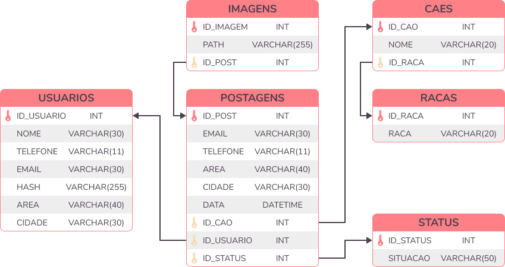

    

# O Projeto

Aplicação desenvolvida para auxiliar na busca de cachorros perdidos utilizando classificação de imagens.

## Aplicativo Mobile

### Algumas das telas disponíveis

    

### Tecnologias utilizadas

## Application Interface Programming (API)

    

### Tecnologias utilizadas

## Classificação de raças

    

### Tecnologias utilizadas

## Banco de Dados

    

### Tecnologias utilizadas

## Demonstração

